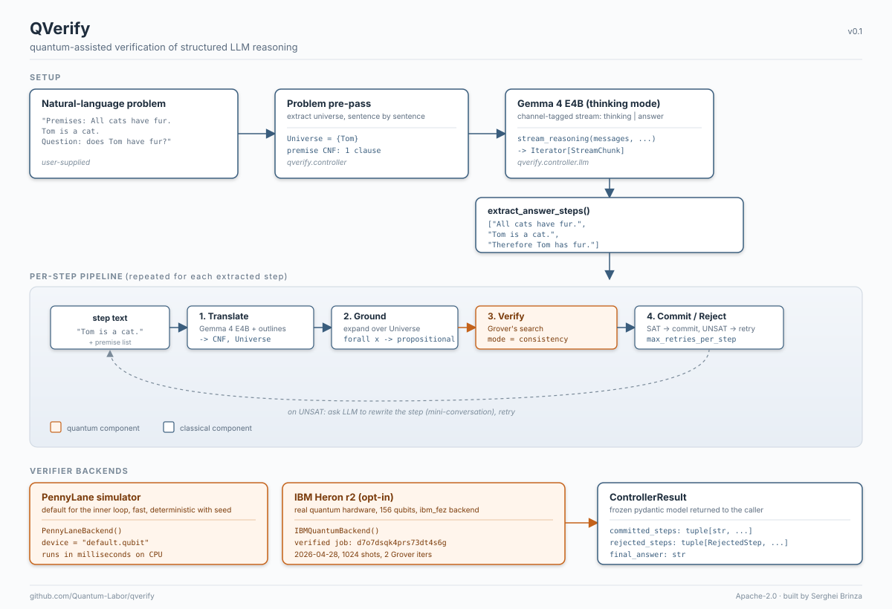
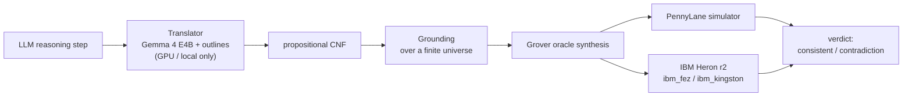

<div align="center">



# QVerify

**A quantum-assisted verifier for LLM reasoning — deployed end to end in the
browser and on real IBM quantum hardware.**

[](https://github.com/Quantum-Labor/qverify/actions/workflows/tests.yml)
[](https://github.com/Quantum-Labor/qverify/actions/workflows/lint.yml)
[](https://github.com/Quantum-Labor/qverify/actions/workflows/deploy-space.yml)
[](https://github.com/Quantum-Labor/qverify/releases/tag/v1.0.1)
[](LICENSE)
[](#the-quantum-co-processor-program)
[](https://huggingface.co/spaces/Laborator/qverify)
[](#verified-on-ibm-quantum-hardware)

</div>

---

Every step a language model emits is translated into propositional CNF, grounded
over a finite universe of constants, and checked for satisfiability by Grover's
algorithm — on either a CPU simulator or IBM's 156-qubit Heron r2 processor. The
verifier surfaces logical contradictions that no output-layer filter can catch,
and it is verified on real quantum hardware, not just in simulation.

## Try it now

**[Open the live demo on Hugging Face → huggingface.co/spaces/Laborator/qverify](https://huggingface.co/spaces/Laborator/qverify)**

Run a CNF through the Grover verifier on the simulator, browse the IBM hardware
gallery, and (as the Space owner) submit a run to real IBM Quantum hardware.

> Owner sign-in: the "Sign in with Hugging Face" button only completes outside the
> embedded iframe, so open the Space at its **direct URL**
> [laborator-qverify.hf.space](https://laborator-qverify.hf.space) to authenticate
> as the owner and unlock the IBM hardware button. The simulator and gallery are
> open to everyone.

## What is this?

Large language models produce fluent reasoning that can still be logically
inconsistent — a chain of steps that quietly contradicts itself. Output filters
and self-critique catch style and policy issues, but not the underlying logic.
QVerify checks the logic directly.

Each reasoning step is translated into a propositional formula in conjunctive
normal form (CNF), grounded over the finite set of constants the step mentions,
and handed to a satisfiability check. Instead of a classical SAT solver, QVerify
synthesises a Grover oracle for the formula and runs Grover's search to look for a
satisfying assignment — returning "consistent" when one exists and flagging a
contradiction when none does. The same `verify()` interface runs on a local
PennyLane simulator or on IBM Heron r2 hardware, so the client code does not change
as quantum hardware scales.

This is project 1 of 3 in the Quantum Co-Processor program: small quantum
subroutines sitting behind stable classical interfaces in an LLM stack.

## How it works (in 30 seconds)

- **Translate** the LLM step to propositional CNF with a grammar-constrained
  decoder (Gemma 4 E4B + outlines). This stage is GPU/local-only and is not part
  of the deployed Space.
- **Ground** the CNF over the finite universe of constants it mentions, producing
  a purely propositional formula.
- **Synthesise** a Grover oracle for the formula and run Grover's search for a
  satisfying assignment.
- **Execute** on the PennyLane statevector simulator (milliseconds) or on IBM
  Heron r2 hardware, then read the verdict from the measurement histogram.

## Benchmarks

`qverify-mini-50` is a hand-crafted suite of 50 SAT/UNSAT formulas covering
propositional contradictions, modus ponens chains, transitivity, resolution,
pigeonhole-tiny, grounded first-order, and AND/OR mixes. Every label was
cross-checked against the PySAT (Glucose3) oracle before commit.

| Metric | Value |
| --- | --- |
| Examples | 50 (25 SAT / 25 UNSAT) |
| Accuracy vs PySAT oracle | **100%** (50 / 50) |
| Average verify time (simulator) | 3.3 s |
| P95 verify time | 0.32 s |
| Atoms per example | 1 – 9 (under the 16-qubit cap) |
| Skipped | 0 |

The average is pulled up by a few larger instances; the **P95 is 0.32 s**, so a
typical step verifies in well under a second on the simulator. Dataset:
[benchmarks/qverify_mini/](benchmarks/qverify_mini/README.md); full per-example
report: [benchmarks/results/qverify_mini_simulator/](benchmarks/results/qverify_mini_simulator/);
methodology and the ProofWriter/RuleTaker harness:
[docs/benchmarks.md](docs/benchmarks.md). The suite is **485 tests, CI green**
(ruff + ruff-format + mypy strict, all clean).

## Verified on IBM Quantum Hardware

QVerify has run on real IBM Quantum hardware **14 times**, on two Heron r2
processors — `ibm_fez` (8 runs) and `ibm_kingston` (6 runs) — each with a public
Job ID anyone with an IBM Quantum account can open. The full gallery (backend,
date, shots, transpiled depth, and atom count per run) renders in the live Space.

Two runs are documented end to end with their formula and verdict:

| Job ID | Backend | Date (UTC) | Formula | Mode | Verdict | Shots | Depth |
| --- | --- | --- | --- | --- | --- | --- | --- |
| [`d7q961poagoc73fj6oag`](https://quantum.cloud.ibm.com/workloads?search=d7q961poagoc73fj6oag) | ibm_fez | 2026-05-01 | `(P ∨ Q) ∧ (¬P ∨ Q)` | consistency | consistent | 1024 | 360 |
| [`d7o7dsqk4prs73dt4s6g`](https://quantum.cloud.ibm.com/workloads?search=d7o7dsqk4prs73dt4s6g) | ibm_fez | 2026-04-28 | `(P ∨ Q) ∧ (¬P ∨ Q)` | consistency | consistent | 1024 | 389 |

Both are single-shot reproducible: open the URL to see the same circuit, shots, and
measurement histogram. The hardware path is bottlenecked by free-tier queue time
(the circuit itself runs in ~6 s on Heron r2); it is not faster than a classical
SAT solver at these sizes — the point is that the quantum verifier is real and runs
on real hardware. Gallery data:
[space/data/hardware_runs.json](space/data/hardware_runs.json).

## Architecture



The translator (the only GPU component) runs locally from the repository; the
deployed Space is verifier-only and runs the Grover pipeline on the CPU simulator
or delegates to IBM hardware.

## Limits (honest scope)

- **Simulator cap.** Statevector simulation costs `2^n` amplitudes, so the
  simulator path is capped (`MAX_VARIABLES = 16` atoms; `MAX_SIMULATOR_QUBITS = 24`
  total wires). Grounded steps over 3–8 premises typically use 4–10 atoms, well
  inside the cap.
- **Hardware is not faster (yet).** Classical SAT solvers handle these instances in
  microseconds; today's quantum path is slower and queue-bound. The value is the
  verified hardware execution and the scale-invariant `verify()` interface, not a
  speed-up.
- **Translator needs a GPU.** The Gemma 4 + outlines translator is local/GPU-only
  and is intentionally not in the deployed Space, which is verifier-only.

## Citation

```bibtex
@misc{brinza2026qverify,
  author       = {Serghei Brinza},
  title        = {QVerify: quantum-assisted verification of LLM reasoning},
  year         = {2026},
  publisher    = {GitHub},
  howpublished = {\url{https://github.com/Quantum-Labor/qverify}},
}
```

## The Quantum Co-Processor program

Three projects exploring quantum subroutines behind classical LLM interfaces:

| | Project | What | Status |
| --- | --- | --- | --- |
| 1 | **QVerify** | Grover-assisted verification of LLM reasoning (this repo) | v1.0.1 ([Space](https://huggingface.co/spaces/Laborator/qverify)) |
| 2 | [QAgent](https://github.com/Quantum-Labor/qagent) | QAOA tool selection | v0.2 ([Space](https://huggingface.co/spaces/Laborator/qagent)) |
| 3 | [QRoute](https://github.com/Quantum-Labor/qroute) | VQC mixture-of-experts router | Phase 1 ([Space](https://huggingface.co/spaces/Laborator/qroute)) |

## License

Apache 2.0. See [LICENSE](LICENSE); dataset attribution in
[benchmarks/LICENSE-DATA.md](benchmarks/LICENSE-DATA.md).

## Author

Serghei Brinza ([@SergheiBrinza](https://github.com/SergheiBrinza))
