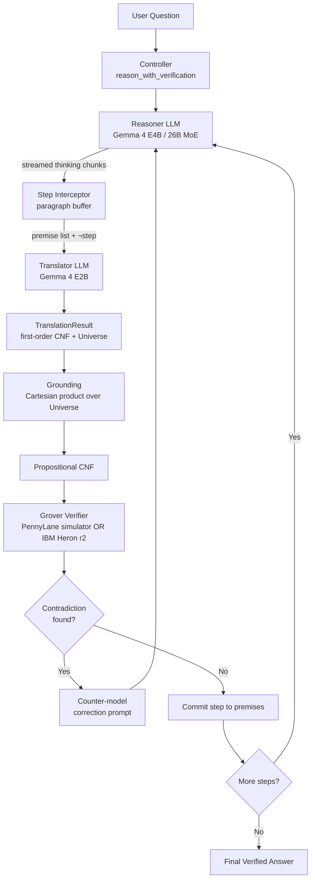

# Architecture

QVerify intercepts each step of a thinking-mode LLM's chain of thought, translates the step into a first-order Boolean satisfiability problem with declared entities, grounds it against a finite universe of discourse, and runs Grover's search on a quantum simulator or real quantum hardware to detect logical contradictions. When the verifier finds a contradiction, the controller feeds the result back to the reasoner and asks it to rewrite the step. The loop continues until the reasoner produces a step that the verifier accepts, then proceeds to the next step.

## Data flow

## Components

- **Controller** (`qverify.controller`) — top-level orchestrator. Streams the reasoner LLM in thinking mode, splits the chain-of-thought into discrete steps on paragraph boundaries, drives the verify-and-rewrite loop, merges the per-call universes from the translator, grounds the combined first-order CNF, and emits real-time events for UI consumption.
- **Translator** (`qverify.translator`) — small LLM (Gemma 4 E2B) wrapped by a defensive parser. Converts each natural-language statement into a [`TranslationResult`](../qverify/translator/types.py) carrying both the CNF and a [`Universe`](../qverify/verifier/_universe.py) of declared constants. Rejects malformed JSON output and consistency mismatches between literal arguments and the entities list.
- **Grounding** (`qverify.verifier.grounding`) — finite-domain instantiation. Replaces every free first-order variable in the combined CNF with every constant in the merged universe, producing the propositional CNF the verifier consumes. See [`docs/grounding.md`](grounding.md).
- **Verifier** (`qverify.verifier`) — Grover's search over the assignment space of the (now propositional) CNF, with a classical post-check on the most-frequent measurement bitstrings. Pluggable backend Protocol with a PennyLane simulator (default for the inner loop) and an IBM Quantum hardware backend (Heron r2, opt-in).

## Quantum verification

See [`docs/grover-explained.md`](grover-explained.md) for the four ingredients (state preparation, oracle, diffusion, measurement), the iteration-count math, and a worked example on the penguin CNF.

## Hardware backends

See [`docs/quantum-hardware-notes.md`](quantum-hardware-notes.md) for IBM Quantum account setup, `.env` layout, the smoke-test command, and the table of verified hardware runs.
