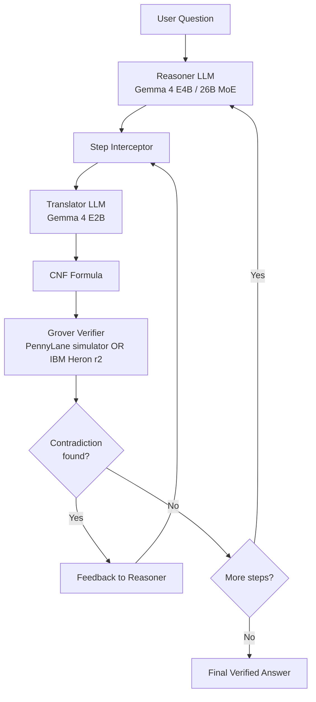

# Architecture

QVerify intercepts each step of a thinking-mode LLM's chain of thought, translates the step into a Boolean satisfiability problem in conjunctive normal form, and runs Grover's search on a quantum simulator or real quantum hardware to detect logical contradictions. When the verifier finds a contradiction, the controller feeds the result back to the reasoner and asks it to rewrite the step. The loop continues until the reasoner produces a step that the verifier accepts, then proceeds to the next step.

## Data flow

## Components

<!-- Filled in Phase 2-5 as each module is implemented. -->

## Quantum verification

<!-- Filled in Phase 3 after the Grover oracle is built. -->

## Hardware backends

<!-- Filled in Phase 4 after IBM Quantum integration. -->
